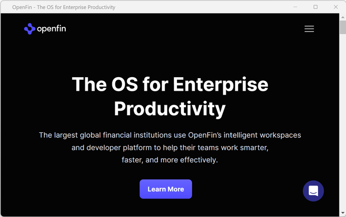

# 001 - Hello OpenFin

The OpenFin product at its core is based on its container technology, think of it as a tab in your web browser. The OpenFin container is completely agnostic to the web framework used to create the web content, in the same way that Chrome doesn't care how your web content is generated.

Run the following command to open any web site in the OpenFin container, you can replace the url with anything you like.

```shell
openfin --url https://www.openfin.co --launch
```

You should see the following window appear on your screen, or your own web page if you changed the url.



## What is happening

The `openfin-cli` generates a manifest file, which is the configuration file that determines how your OpenFin application will behave, in this case it will display a `Classic` window.

```json
{
  "startup_app": {
    "name": "app-1677151344031-345",
    "uuid": "app-1677151344031-345",
    "url": "https://www.openfin.co",
    "autoShow": true
  },
  "runtime": {
    "version": "stable"
  }
}
```

The `openfin-cli` uses the manifest to launch the application, this process will also download the OpenFin runtime if it is not already available on your machine.

:tada: Congratulations you have now run your first OpenFin application.

---

:arrow_right: Next [002 - OpenFin Manifest](../002-openfin-manifest/README.md)

## Further Reading

- [OpenFin CLI tool](https://developers.openfin.co/of-docs/docs/openfin-cli-tool)
