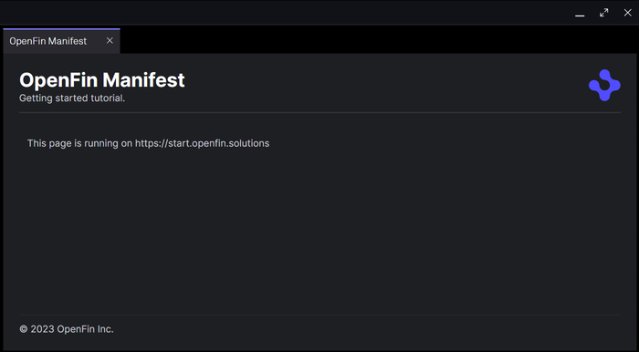

# 002 - OpenFin Manifest

The manifest describes how your application works and how it displays.

As shown in the earlier getting started steps you can run your application content from a remote server. You can also run it from a local server, but remote is recommended for production so that it is both easy to update the content, and there is no necessity for the client machine to have either the content or a local server.

For this example we have created an example web page and assets, the page is written using vanilla HTML.

## Deploying Remotely

You can deploy the content of the folder remotely using the hosting services of your choice. We have already deployed a version to <https://start.openfin.solutions/002-openfin-manifest/>

## Deploying Locally

You can serve the web page locally with your own web server. If you don't already have a local web server you can install one using `npm install serve -g`. You can then serve the content from the folder with the command below, which should make it available at <http://localhost:4545/>.

```shell
serve -p 4545
```

## The manifest

Instead of using the CLI tool to generate a manifest and launch the application we will manually create a manifest. We will no longer use the `startup_app` properties, as this is for a `Classic` window, instead we will switch to `Container` configuration which will provide more flexibility in terms of layout.

The manifest for the remote hosted version [manifest.remote.fin.json](./manifest.remote.fin.json) is as follows:

```json
{
  "runtime": {
    "version": "stable" // Choosing stable for the runtime version will keep it evergreen, but you can use a fixed version
  },
  "platform": {
    "uuid": "002-openfin-manifest-remote", // The id of the application
    "autoShow": false, // Set this to true to show the hidden platform window to aid in debugging
    "icon": "https://start.openfin.solutions/002-openfin-manifest/favicon.ico"
  },
  "snapshot": {
    // In this layout we have a single window with one view displayed as a tab
    "windows": [
      {
        "layout": {
          "content": [
            {
              "type": "stack",
              "content": [
                {
                  "type": "component",
                  "componentName": "view",
                  "componentState": {
                    "url": "https://start.openfin.solutions/002-openfin-manifest/"
                  }
                }
              ]
            }
          ]
        }
      }
    ]
  }
}
```

The manifest for the local hosted version [manifest.local.fin.json](./manifest.local.fin.json) is identical except for the value of the `icon` and `url` properties.

## Launching a manifest

In the windows shell you can launch applications using the `start` command, which will open the correct application based on the parameters provided.

For example to launch a web page you could use `start https://www.openfin.co`. The shell determines that `https` uses a web handler and so opens the page in your web browser.

For OpenFin we have our own variation on this, where the protocol is either `fin` or `fins` depending on wether the content is secure.

Assuming we already have our content hosted we can launch either the remote manifest with:

```shell
start fins://start.openfin.solutions/002-openfin-manifest/manifest.remote.fin.json
```

or a locally served manifest:

```shell
start fin://localhost:4545/manifest.local.fin.json
```

## What is happening

Opening a `fins` link first launches the `OpenFinRVM`, the runtime version manager. The RVM loads the manifest and determines the version of the OpenFin runtime required, if the runtime is not on the local machine it downloads it.

The application is then launched using the installed runtime, it first creates a hidden platform window, which in turn launches the windows layout.

You should see the following window:



:tada: Congratulations you are now running a container platform with a manual manifest.

---

:arrow_right: Next [003 - OpenFin API](../003-openfin-api/README.md)

## Further Reading

- [Container Overview](https://developers.openfin.co/of-docs/docs/container-overview)
- [Application Configuration](https://developers.openfin.co/of-docs/docs/application-configuration)
- [Fins Links](https://developers.openfin.co/of-docs/docs/openfin-installer#protocol-handler-fin-fins)
